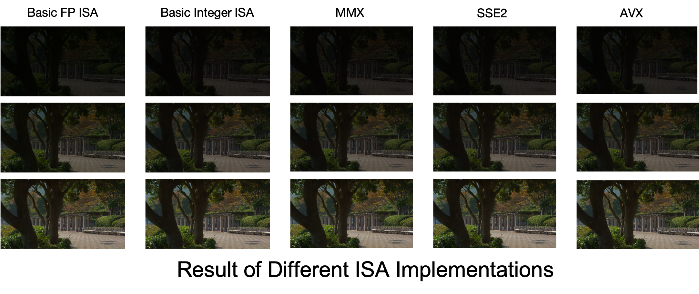

# <center>计算机组织与体系结构Lab 4</center>

## <center>面向特定应用的体系结构优化</center>

<center style="font-family: sans-serif;">何昊 1600012742</center>

## 一、使用SIMD指令对应用程序进行优化

### 1. 程序需求及其实现

本次要优化的应用程序功能是对YUV图像的淡入淡出进行处理。具体地说，先读入一个YUV文件，对其中的第一个图像，生成一个包含Alpha值从低到高的一组图像的YUV影片。对于每一个YUV像素，转换的公式如下

1. YUV2RGB转换
$$
R = 1.164383 * (Y - 16) + 1.596027*(V - 128)\\
B = 1.164383 * (Y - 16) + 2.017232*(U - 128)\\
G = 1.164383 * (Y - 16) – 0.391762*(U - 128) – 0.812968*(V - 128)
$$

2. RGB格式下的Alpha Blending
$$
R’=A*R/256\\
G’=A*G/256\\
B’=A*B/256
$$

3. RGB2YUV转换
$$
Y= 0.256788*R' + 0.504129*G' + 0.097906*B' + 16\\
U= -0.148223*R' - 0.290993*G' + 0.439216*B' + 128\\
V= 0.439216*R' - 0.367788*G' - 0.071427*B' + 128
$$

优化的目标是使用SIMD指令对程序中核心运算部分进行指令级并行优化，加快程序的运行速度。因此，对于图像的淡入淡出处理函数，我分别实现了浮点运算、整数运算、MMX、SSE2、AVX五个不同的版本。不同版本的核心源码参见附录，源程序文件参见`YuvImageProcessor.cpp`。

显然，上述运算中，对于向量$(Y,U,V)$和向量$(R,G,B)$，(1)和(3)本质上是向量点积，(2)本质上是向量乘法，这些都可以使用SIMD指令并行化。下面简述各个版本的实现思路。

1. 浮点运算的实现相对比较简单，直接翻译YUV和RGB转换公式即可。
2. 由于大多数CPU的整数运算比浮点运算快，加之YUV与RGB之间的转换对精度要求不高，因此也是可以用整数运算实现的(https://stackoverflow.com/questions/1737726/how-to-perform-rgb-yuv-conversion-in-c-c)。
3. MMX指令集是比较老的SIMD指令集，只支持整数运算，因此只能用于并行化整数运算的版本。在实现中，使用了此外，由于MMX指令集的寄存器大小为64位，在转换过程中，点积运算后所得到的结果无法并行，因为如果用16位整数储存结果会导致溢出，无法得到正确的转换结果，这限制了算法的性能提升。
4. SSE指令集可以对128位SIMD寄存器进行操作，也就是可以同时对4个32位浮点数进行运算，从而只需直接将计算翻译成SIMD指令即可。此外，SSE还提供了向量点积的计算指令和向量重排指令，从而减少了实现相同运算所需要的指令数。
5. AVX指令集将SIMD寄存器的位数扩展到256位，那么潜在地就可以一条指令同时计算8个32位浮点数。那么，为了能够充分利用256位的寄存器，必须将算法修改成能一次性计算8个数据的版本。因此，我采用了类似循环转开的思路，每轮循环计算两个$(Y, U, V)$向量和$(R, G, B)$向量。

### 2. 程序运行结果

五种不同版本的淡入淡出函数对`dem1.yuv`的输出结果见下图。尽管5个不同的版本的计算方式不同，最后得到的数值也略有差异，但是从下图可见，淡入淡出的效果差异是几乎无法用肉眼分辨的。



对`dem2.yuv`的输出结果如下


### 3. 性能统计结果

下表中列出了基于不同指令集实现的同样算法对$1920\times 1080$大小的YUV图片进行淡入淡出转换并生成83张不同透明度的$1920\times 1080$的YUV图片的运行时间。对于每种算法，我们运行10遍求平均值以减少误差。运行时间的测量使用了C++ 11引入的高精度时钟API(`<chrono>`)。代码的运行环境为Mac OS Mojave，编译器为`Apple LLVM 10.0.1(clang-1001.0.46.4)`，优化级别为`-O2`，CPU型号为`Intel Core i5-6360U(Skylake), 2GHz`.

| 运行次数 | Basic FP | Basic Int | MMX    | SSE2   | AVX   |
| -------- | -------- | --------- | ------ | ------ | ----- |
| Round 1  | 2572ms   | 1677ms    | 1535ms | 1016ms | 807ms |
| Round 2  | 2635ms   | 1653ms    | 1535ms | 1031ms | 811ms |
| Round 3  | 2683ms   | 1692ms    | 1593ms | 1036ms | 853ms |
| Round 4  | 2755ms   | 1804ms    | 1575ms | 1041ms | 851ms |
| Round 5  | 2723ms   | 1714ms    | 1573ms | 1042ms | 851ms |
| Round 6  | 2795ms   | 1754ms    | 1627ms | 1064ms | 854ms |
| Round 7  | 2751ms   | 1741ms    | 1626ms | 1069ms | 850ms |
| Round 8  | 2756ms   | 1752ms    | 1621ms | 1063ms | 872ms |
| Round 9  | 2684ms   | 1737ms    | 1613ms | 1067ms | 901ms |
| Round 10 | 2696ms   | 1800ms    | 1743ms | 1056ms | 853ms |
| Average  | 2705ms   | 1732ms    | 1604ms | 1049ms | 850ms |

由于Basic Int和MMX都是用同样的整数运算算法实现的，因此可以对其性能进行比较。使用MMX对整数运算进行并行优化的收益是很小的，这可能是因为：1. 部分关键的点积运算因为16bit整数溢出问题无法并行。2. 整数运算在现代体系结构中普遍使用了乱序执行和多发射流水线，一定程度地实现指令级并行。

类似地，我们可以对Basic FP、SSE2和AVX作比较。SSE2对Basic FP实现了接近3x的性能提升，因为SSE将对$(Y,U,V)$和$(R,G,B)$向量的操作并行化了。但是，AVX的实现和SSE2相比的提升却不明显。这是由于当前算法无法以一种很好地方式利用到8个32位浮点数的并行操作。在AVX实现中，我使用了类似循环展开的方式，同时对两个$(Y,U,V)$和$(R,G,B)$向量进行计算操作，并且手动实现了8个浮点数的点积运算，而不是像SSE那样用一条指令实现点积运算，这些都会带来性能损失。

总而言之，SIMD指令集对图像处理应用程序的优化还是非常显著的。采用AVX指令集的算法和Basic FP相比，性能提升了3.182倍。

## 二、设计自定义扩展指令对SIMD应用优化并分析

### 1. 需要实现的指令集

本实验的目标是设计若干32位宽的扩展指令，支持8个宽度为256位的SIMD指令专用寄存器，支持8/16/32位pack、unpack计算，支持加/减/乘法，支持饱和计算，支持必要的数据传输指令。

### 2. 指令助记符及其功能

8个256位SIMD寄存器分别用v0, v2, …, v7表示。在下面的表格中，用`vn`表示一个SIMD寄存器，用`rn`表示任意一个64位通用寄存器。

| 指令         | 功能                                    |
| ------------ | --------------------------------------- |
| `lv vn, rx, ry` | 将从地址`rn`开始的`ry`个字节读入`vn`(`ry`取值1到32)，其余部分填0 |
| `sv vn, rx, ry` | 将`vn`里的前`ry`个字节存入地址`rn`开始的`ry`个字节处(`ry`取值1到32) |
| `addvi32p vn, vx, vy` | 将`vx`和`vy`寄存器内的值按packed 32位整数相加 |
| `addvi32ps vn, vx, vy` | 将`vx`和`vy`寄存器内的值按packed 32位整数饱和相加 |
| `addvi64p vn, vx, vy` | 将`vx`和`vy`寄存器内的值按packed 64位整数相加 |
| `addvi64ps vn, vx, vy` | 将`vx`和`vy`寄存器内的值按packed 64位整数饱和相加 |
| `addvf32p vn, vx, vy` | 将`vx`和`vy`寄存器内的值按packed 32位浮点数相加 |
| `addvf64p vn, vx, vy` | 将`vx`和`vy`寄存器内的值按packed 64位浮点数相加 |
| `subvi32p vn, vx, vy` | 将`vx`和`vy`寄存器内的值按packed 32位整数相减 |
| `subvi32ps vn, vx, vy` | 将`vx`和`vy`寄存器内的值按packed 32位整数饱和相减 |
| `subvi64p vn, vx, vy` | 将`vx`和`vy`寄存器内的值按packed 64位整数相减 |
| `subvi64ps vn, vx, vy` | 将`vx`和`vy`寄存器内的值按packed 64位整数饱和相减 |
| `subvf32p vn, vx, vy` | 将`vx`和`vy`寄存器内的值按packed 32位浮点数相减 |
| `subvf64p vn, vx, vy` | 将`vx`和`vy`寄存器内的值按packed 64位浮点数相减 |
| `mulvi32p vn, vx, vy` | 将`vx`和`vy`寄存器内的值按packed 32位整数相乘 |
| `mulvi32ps vn, vx, vy` | 将`vx`和`vy`寄存器内的值按packed 32位整数饱和相乘 |
| `mulvi64p vn, vx, vy` | 将`vx`和`vy`寄存器内的值按packed 64位整数相乘 |
| `mulvi64ps vn, vx, vy` | 将`vx`和`vy`寄存器内的值按packed 64位整数饱和相乘 |
| `mulvf32p vn, vx, vy` | 将`vx`和`vy`寄存器内的值按packed 32位浮点数相乘 |
| `mulvf64p vn, vx, vy` | 将`vx`和`vy`寄存器内的值按packed 64位浮点数相乘 |
| `unpckvf32hi vn, vx, vy` | 对`vx`和`vy`寄存器内的高4个32位浮点数进行unpack操作，结果存于`vn` |
| `unpckvf32lo vn, vx, vy` | 对`vx`和`vy`寄存器内的低4个32位浮点数进行unpack操作，结果存于`vn` |
| `unpckvf64hi vn, vx, vy` | 对`vx`和`vy`寄存器内的高2个64位浮点数进行unpack操作，结果存于`vn` |
| `unpckvf64lo vn, vx, vy` | 对`vx`和`vy`寄存器内的低2个64位浮点数进行unpack操作，结果存于`vn` |
| `sumvf64 vn, vx, rx` | 将`vx`寄存器的4个64位浮点数求和，存于`vn`寄存器的第`rx`个位置(`rx`必须取0-3)|
| `maxvf64 vn, vx, vy` | 将`vx`寄存器的4个64位浮点数和`vy`寄存器的4个64位浮点数比较，存较大值于`vn`的相应位置|
| `minvf64 vn, vx, vy` | 将`vx`寄存器的4个64位浮点数和`vy`寄存器的4个64位浮点数比较，存较小值于`vn`的相应位置|

上述指令已经符合前述要求，且足够实现前述的图像处理算法。可以很容易添加实现更多功能的SIMD指令。


### 3. 指令编码

上述所有指令都是三个操作数，其中通用寄存器需要5个位表示，SIMD寄存器需要5个位表示，但是为了方便解码起见，两类寄存器在指令里可以都占用5个位。为了尽可能与RISCV其他扩展指令集兼容和简化指令解码过程，本指令集内所有指令采用同一个opcode，寄存器的编码位置保持不变。这样还剩下7位+3位空余域，可以编码1024个指令，依然具有足够大的编码空间。其中，七位`funct7`用于编码某一类指令(例如加法指令或者减法指令)，而三位`funct3`用于编码当前指令是这一类指令中的哪一种。

指令的编码如下

```
 funct7  rs2     rs1     funct3  rd     opcode
|31 - 25|24 - 20|19 - 15|14 - 12|11 - 7|6  -  0| 对应指令
|0000000|  ry   |  rx   |  000  |  vn  |1101111| lv vn, rx, ry
|0000000|  ry   |  rx   |  001  |  vn  |1101111| sv vn, rx, ry
|0000001|  vy   |  vx   |  000  |  vn  |1101111| addvi32p vn, vx, vy
|0000001|  vy   |  vx   |  001  |  vn  |1101111| addvi32ps vn, vx, vy
|0000001|  vy   |  vx   |  010  |  vn  |1101111| addvi64p vn, vx, vy
|0000001|  vy   |  vx   |  011  |  vn  |1101111| addvi64s vn, vx, vy
|0000001|  vy   |  vx   |  100  |  vn  |1101111| addvf32p vn, vx, vy
|0000001|  vy   |  vx   |  101  |  vn  |1101111| addvf64p vn, vx, vy
|0000010|  vy   |  vx   |  000  |  vn  |1101111| subvi32p vn, vx, vy
|0000010|  vy   |  vx   |  001  |  vn  |1101111| subvi32ps vn, vx, vy
|0000010|  vy   |  vx   |  010  |  vn  |1101111| subvi64p vn, vx, vy
|0000010|  vy   |  vx   |  011  |  vn  |1101111| subvi64ps vn, vx, vy
|0000010|  vy   |  vx   |  100  |  vn  |1101111| subvf32p vn, vx, vy
|0000010|  vy   |  vx   |  101  |  vn  |1101111| subvf64p vn, vx, vy
|0000011|  vy   |  vx   |  000  |  vn  |1101111| mulvi32p vn, vx, vy
|0000011|  vy   |  vx   |  001  |  vn  |1101111| mulvi32ps vn, vx, vy
|0000011|  vy   |  vx   |  010  |  vn  |1101111| mulvi64p vn, vx, vy
|0000011|  vy   |  vx   |  011  |  vn  |1101111| mulvi64ps vn, vx, vy
|0000011|  vy   |  vx   |  100  |  vn  |1101111| mulvf32p vn, vx, vy
|0000011|  vy   |  vx   |  101  |  vn  |1101111| mulvf64p vn, vx, vy
|0000100|  vy   |  vx   |  000  |  vn  |1101111| unpckvf32hi vn, vx, vy
|0000100|  vy   |  vx   |  001  |  vn  |1101111| unpckvf32lo vn, vx, vy
|0000100|  vy   |  vx   |  010  |  vn  |1101111| unpckvf64hi vn, vx, vy
|0000100|  vy   |  vx   |  011  |  vn  |1101111| unpckvf64lo vn, vx, vy
|0000101|  rx   |  vx   |  000  |  vn  |1101111| sumvf64 vn, vx, rx
|0000110|  vy   |  vx   |  000  |  vn  |1101111| minvf64 vn, vx, vy
|0000111|  vy   |  vx   |  000  |  vn  |1101111| maxvf64 vn, vx, vy
```

### 4. 重新编写的图像计算核心函数

下面写出的代码假设上述设计的指令集已经类似Intel Intrinsics那样在C语言内提供了封装对应指令的函数，函数名就是指令名，函数参数就是指令需要的参数，8个SIMD寄存器变量是全局变量，命名分别为v0, v1, …, v7。

```c
void processYuvRISCV() {
  int total = width * height;
  struct Vec {
    double a[4];
  } *data = new Vec[total];

  for (int i = 0; i < height; ++i) {
    for (int j = 0; j < width; ++j) {
      int offset = i * width + j;
      int uIndex = (i / 2) * (width / 2) + (j / 2) + total;
      int vIndex = (i / 2) * (width / 2) + (j / 2) + total + (total / 4);
      double zero[4] = {0, 0, 0, 0};
      double max[4] = {255, 255, 255, 255};
      double t0[4] = {(uint8_t)yuv[offset], (uint8_t)yuv[uIndex], 
                      (uint8_t)yuv[vIndex], 0.0};
      double t1[4] = {16.0, 128.0, 128.0, 0.0}
      double t2[4] = {1.164383, 0.0, 1.596027, 0.0};
      double t3[4] = {1.164383, -0.391762, -0.812968, 0.0};
      double t4[4] = {1.164384, 2.017232, 0.0, 0.0};
      lv(v0, t0, 32);
      lv(v1, t1, 32);
      subvf64p(v1, v0, v1);
      lv(v2, t2, 32);
      lv(v3, t3, 32);
      lv(v4, t4, 32);
      mulvf64p(v2, v1, v2);
      mulvf64p(v3, v1, v3);
      mulvf64p(v4, v1, v4);
      lv(v5, zero, 32);
      sumvf64(v5, v2, 0);
      sumvf64(v5, v3, 1);
      sumvf64(v5, v4, 2);
      lv(v6, max, 32);
      lv(v7, zero, 32);
      minvf64(v5, v5, v6);
      maxvf64(v5, v5, v7);
      sv(v5, data[offset].a, 32);
    }
  }

  for (int num = 0; num < NUM_FRAMES; ++num) {
    int a = num * 3 + 1;
    for (int i = 0; i < height; ++i) {
      for (int j = 0; j < width; ++j) {
        int offset = i * width + j;
        int uIndex = (i / 2) * (width / 2) + (j / 2) + total;
        int vIndex = (i / 2) * (width / 2) + (j / 2) + total + (total / 4);
        double t0[4] = {a / 255, a / 255, a / 255, 0.0};
        double yc[4] = {0.256788, 0.504129, 0.097906, 0.0};
        double uc[4] = {-0.148223, 0.290993, 0.439126, 0.0};
        double vc[4] = {0.439126, -0.367788, -0.071427, 0.0};
        double t2[4] = {16, 128, 128, 0};
        double zero[4] = {0, 0, 0, 0};
        double t3[4];
        lv(v0, t0, 32);
        lv(v1, data[offset].a, 24);
        lv(v2, yc, 32);
        lv(v3, uc, 32);
        lv(v4, vc, 32);
        mulvf64p(v2, v1, v2);
        mulvf64p(v3, v1, v2);
        mulvf64p(v4, v1, v2);
        lv(v5, zero, 32);
        sumvf64(v5, v2, 0);
        sumvf64(v5, v3, 1);
        sumvf64(v5, v4, 2);
        lv(v6, t2, 32);
        subvf64p(v5, v5, v6);
        sv(v5, t3, 32);
        result[num][offset] = (int)t3[0];
        result[num][uIndex] = (int)t3[1];
        result[num][vIndex] = (int)t3[2];
      }
    }
  }

  delete[] data;
}
```

### 5. 性能分析

由于无法确切得知使用SIMD计算能够减少使用的确切指令数，因此只能对其性能提升做估算。在上述程序中，使用的SIMD指令共有33条，每条SIMD指令同时对4个64位浮点数做操作。如果不使用SIMD实现，那么每条SIMD指令需要用4倍数量的指令来实现，那么对于每个像素点，使用SIMD指令可以潜在少执行$33*(4-1)=99$条指令。对于$1920\times 1080$大小的图像，共可以减少$99\times 1920\times 1080=2.0529\times 10^8$条指令。

对于每个循环而言，循环体中不是所有指令都是SIMD指令，SIMD计算之外的开销对于两个版本的实现是一样的，因此理论性能提升幅度接近4倍，但会比4倍小。根据之前编写的X86 SIMD程序的经验，实际的提升幅度会在2-3倍之间。

## 附录

### 1. 不同版本的核心源码

#### (1) 浮点运算的实现

```c++
void processYuv() {
  int total = width * height;
  Pixel *data = new Pixel[total];

  for (int i = 0; i < height; ++i) {
    for (int j = 0; j < width; ++j) {
      int offset = i * width + j;
      int y = (uint8_t)yuv[offset];
      int u = (uint8_t)yuv[(i / 2) * (width / 2) + (j / 2) + total];
      int v = (uint8_t)yuv[(i / 2) * (width / 2) + (j / 2) + total + (total / 4)];
      int r = 1.164383 * (y - 16) + 1.596027 * (v - 128);
      int g = 1.164383 * (y - 16) - 0.391762 * (u - 128) - 0.812968 * (v - 128);
      int b = 1.164383 * (y - 16) + 2.017232 * (u - 128);
      data[offset].r = clamp(r, 0, 255);
      data[offset].g = clamp(g, 0, 255);
      data[offset].b = clamp(b, 0, 255);
    }
  }

  for (int num = 0; num < NUM_FRAMES; ++num) {
    int a = num * 3 + 1;
    for (int i = 0; i < height; ++i) {
      for (int j = 0; j < width; ++j) {
        int offset = i * width + j;
        int r = data[offset].r * a / 255.0;
        int g = data[offset].g * a / 255.0;
        int b = data[offset].b * a / 255.0;
        int y = 0.256788 * r + 0.504129 * g + 0.097906 * b + 16;
        int u = -0.148223 * r - 0.290993 * g + 0.439216 * b + 128;
        int v = 0.439216 * r - 0.367788 * g - 0.071427 * b + 128;
        result[num][offset] = y;
        result[num][(i / 2) * (width / 2) + (j / 2) + total] = u;
        result[num][(i / 2) * (width / 2) + (j / 2) + total + (total / 4)] = v;
      }
    }
  }

  delete[] data;
}
```

#### (2) 整数运算的实现

```c++
/*
 * YUV and RGB conversion in integer arithmetics
 */
#define CLIP(X) ( (X) > 255 ? 255 : (X) < 0 ? 0 : X)

// RGB -> YUV
#define RGB2Y(R, G, B) CLIP(( (  66 * (R) + 129 * (G) +  25 * (B) + 128) >> 8) +  16)
#define RGB2U(R, G, B) CLIP(( ( -38 * (R) -  74 * (G) + 112 * (B) + 128) >> 8) + 128)
#define RGB2V(R, G, B) CLIP(( ( 112 * (R) -  94 * (G) -  18 * (B) + 128) >> 8) + 128)

// YUV -> RGB
#define C(Y) ( (Y) - 16  )
#define D(U) ( (U) - 128 )
#define E(V) ( (V) - 128 )

#define YUV2R(Y, U, V) CLIP(( 298 * C(Y)              + 409 * E(V) + 128) >> 8)
#define YUV2G(Y, U, V) CLIP(( 298 * C(Y) - 100 * D(U) - 208 * E(V) + 128) >> 8)
#define YUV2B(Y, U, V) CLIP(( 298 * C(Y) + 516 * D(U)              + 128) >> 8)

void processYuvInt() {
  int total = width * height;
  Pixel *data = new Pixel[total];

  for (int i = 0; i < height; ++i) {
    for (int j = 0; j < width; ++j) {
      int offset = i * width + j;
      uint8_t y = (uint8_t)yuv[offset];
      uint8_t u = (uint8_t)yuv[(i / 2) * (width / 2) + (j / 2) + total];
      uint8_t v = (uint8_t)yuv[(i / 2) * (width / 2) + (j / 2) + total + (total / 4)];
      data[offset].r = YUV2R(y, u, v);
      data[offset].g = YUV2G(y, u, v);
      data[offset].b = YUV2B(y, u, v);
    }
  }

  for (int num = 0; num < NUM_FRAMES; ++num) {
    int a = num * 3 + 1;
    for (int i = 0; i < height; ++i) {
      for (int j = 0; j < width; ++j) {
        int offset = i * width + j;
        int32_t r = data[offset].r * a / 255;
        int32_t g = data[offset].g * a / 255;
        int32_t b = data[offset].b * a / 255;
        result[num][offset] = (char)RGB2Y(r, g, b);
        result[num][(i / 2) * (width / 2) + (j / 2) + total] = (char)RGB2U(r, g, b);
        result[num][(i / 2) * (width / 2) + (j / 2) + total + (total / 4)] = (char)RGB2V(r, g, b);
      }
    }
  }

  delete[] data;
}
```

#### (3) X86 MMX指令集的实现

```c++
void processYuvMMX() {
  int total = width * height;
  union Vec {
    uint16_t a[4];
    __m64 val;
  } *data = new Vec[total];

  for (int i = 0; i < height; ++i) {
    for (int j = 0; j < width; ++j) {
      int offset = i * width + j;
      int uIndex = (i / 2) * (width / 2) + (j / 2) + total;
      int vIndex = (i / 2) * (width / 2) + (j / 2) + total + (total / 4);
      uint8_t y = (uint8_t)yuv[offset];
      uint8_t u = (uint8_t)yuv[uIndex];
      uint8_t v = (uint8_t)yuv[vIndex];
      __m64 c1 = _mm_set_pi16(0, 128, 128, 16);
      __m64 c2 = _mm_set_pi16(0, 409, 0, 298);
      __m64 c3 = _mm_set_pi16(0, -208, -100, 298);
      __m64 c4 = _mm_set_pi16(0, 0, 516, 298);
      __m64 t0 = _mm_sub_pi16(_mm_set_pi16(0, v, u, y), c1);
      __m64 t1 = _mm_madd_pi16(t0, c2);
      __m64 t2 = _mm_madd_pi16(t0, c3);
      __m64 t3 = _mm_madd_pi16(t0, c4);
      int t4 = CLIP(((_mm_cvtsi64_si32(t3) + int(_mm_cvtm64_si64(t3)>>32)) + 128) >> 8);
      int t5 = CLIP(((_mm_cvtsi64_si32(t2) + int(_mm_cvtm64_si64(t2)>>32)) + 128) >> 8);
      int t6 = CLIP(((_mm_cvtsi64_si32(t1) + int(_mm_cvtm64_si64(t1)>>32)) + 128) >> 8);
      data[offset].val = _mm_set_pi16(0, t4, t5, t6);
    }
  }

  for (int num = 0; num < NUM_FRAMES; ++num) {
    int a = num * 3 + 1;
    for (int i = 0; i < height; ++i) {
      for (int j = 0; j < width; ++j) {
        int offset = i * width + j;
        int uIndex = (i / 2) * (width / 2) + (j / 2) + total;
        int vIndex = (i / 2) * (width / 2) + (j / 2) + total + (total / 4);
        __m64 rgb = _mm_srl_pi16(_mm_mullo_pi16(data[offset].val, _mm_set1_pi16(a)), _mm_set_pi32(0, 8));
        __m64 c1 = _mm_set_pi16(0, 25, 129, 66);
        __m64 c2 = _mm_set_pi16(0, 112, -74, -38);
        __m64 c3 = _mm_set_pi16(0, -18, -94, 112);
        __m64 t1 = _mm_madd_pi16(rgb, c1);
        __m64 t2 = _mm_madd_pi16(rgb, c2);
        __m64 t3 = _mm_madd_pi16(rgb, c3);
        int t4 = (((_mm_cvtsi64_si32(t1) + int(_mm_cvtm64_si64(t1)>>32)) + 128) >> 8) + 16;
        int t5 = (((_mm_cvtsi64_si32(t2) + int(_mm_cvtm64_si64(t2)>>32)) + 128) >> 8) + 128;
        int t6 = (((_mm_cvtsi64_si32(t3) + int(_mm_cvtm64_si64(t3)>>32)) + 128) >> 8) + 128;

        result[num][offset] = t4;
        result[num][uIndex] = t5;
        result[num][vIndex] = t6;
      }
    }
  }

  delete[] data;
}
```

#### (4) X86 SSE2指令集的实现

```c++
void processYuvSSE2() {
  int total = width * height;
  struct Vec {
    float a[4];
  } *data = new Vec[total];

  for (int i = 0; i < height; ++i) {
    for (int j = 0; j < width; ++j) {
      int offset = i * width + j;
      int uIndex = (i / 2) * (width / 2) + (j / 2) + total;
      int vIndex = (i / 2) * (width / 2) + (j / 2) + total + (total / 4);

      __m128 t0 = _mm_set_ps(0.0f, (uint8_t)yuv[vIndex], (uint8_t)yuv[uIndex],
                             (uint8_t)yuv[offset]);
      __m128 t1 = _mm_sub_ps(t0, _mm_set_ps(0.0f, 128.0f, 128.0f, 16.0f));
      __m128 t2 = _mm_set_ps(0.0f, 1.596027f, 0.0f, 1.164383f);
      __m128 t3 = _mm_set_ps(0.0f, -0.812968f, -0.391762f, 1.164383f);
      __m128 t4 = _mm_set_ps(0.0f, 0.0f, 2.017232f, 1.164383f);
      __m128 t5 = _mm_dp_ps(t1, t2, 0b11110001);
      __m128 t6 = _mm_dp_ps(t1, t3, 0b11110010);
      __m128 t7 = _mm_dp_ps(t1, t4, 0b11110100);
      __m128 rgb = _mm_add_ps(_mm_add_ps(t5, t6), t7);
      __m128 zero = _mm_set_ps(0.0f, 0.0f, 0.0f, 0.0f);
      __m128 max = _mm_set_ps(255.0f, 255.0f, 255.0f, 255.0f);
      rgb = _mm_max_ps(rgb, zero);
      rgb = _mm_min_ps(rgb, max);
      _mm_store_ps(data[offset].a, rgb);
    }
  }

  for (int num = 0; num < NUM_FRAMES; ++num) {
    int a = num * 3 + 1;
    for (int i = 0; i < height; ++i) {
      for (int j = 0; j < width; ++j) {
        int offset = i * width + j;
        int uIndex = (i / 2) * (width / 2) + (j / 2) + total;
        int vIndex = (i / 2) * (width / 2) + (j / 2) + total + (total / 4);

        __m128 t0 = _mm_set_ps(0.0f, a, a, a);
        __m128 t1 = _mm_div_ps(t0, _mm_set_ps(255.0f, 255.0f, 255.0f, 255.0f));
        __m128 rgb = _mm_mul_ps(t1, _mm_load_ps(data[offset].a));
        __m128 yc = _mm_set_ps(0.0f, 0.097906f, 0.504129f, 0.256788f);
        __m128 uc = _mm_set_ps(0.0f, 0.439126f, -0.290993f, -0.148223f);
        __m128 vc = _mm_set_ps(0.0f, -0.071427f, -0.367788f, 0.439216f);
        __m128 y = _mm_dp_ps(rgb, yc, 0b11110001);
        __m128 u = _mm_dp_ps(rgb, uc, 0b11110010);
        __m128 v = _mm_dp_ps(rgb, vc, 0b11110100);
        __m128 t2 = _mm_add_ps(_mm_add_ps(y, _mm_add_ps(u, v)),
                               _mm_set_ps(0.0f, 128.0f, 128.0f, 16.0f));
        __m128i t2i = _mm_cvtps_epi32(t2);

        result[num][offset] = _mm_extract_epi32(t2i, 0);
        result[num][uIndex] = _mm_extract_epi32(t2i, 1);
        result[num][vIndex] = _mm_extract_epi32(t2i, 2);
      }
    }
  }

  delete[] data;
}
```

#### (5) X86 AVX指令集的实现

```c++
void processYuvAVX() {
  int total = width * height;
  struct Vec {
    float a[8];
  } *data = new Vec[total / 2];
  
  for (int i = 0; i < height; ++i) {
    for (int j = 0; j < width; j += 2) {
      int offset = i * width + j;
      int uIndex = (i / 2) * (width / 2) + (j / 2) + total;
      int vIndex = (i / 2) * (width / 2) + (j / 2) + total + (total / 4);

      __m256 zero = _mm256_set1_ps(0.0f);
      __m256 max = _mm256_set1_ps(255.0f);
      __m256 t0 =
          _mm256_set_ps(0.0f, (uint8_t)yuv[vIndex], (uint8_t)yuv[uIndex],
                        (uint8_t)yuv[offset + 1], 0.0f, (uint8_t)yuv[vIndex],
                        (uint8_t)yuv[uIndex], (uint8_t)yuv[offset]);
      __m256 t1 = _mm256_set_ps(0.0f, 128.0f, 128.0f, 16.0f, 0.0f, 128.0f, 128.0f, 16.0f);
      __m256 t2 = _mm256_sub_ps(t0, t1);
      __m256 t3 = _mm256_set_ps(0.0f, 1.596027f, 0.0f, 1.164383f, 0.0f, 1.596027f, 0.0f, 1.164383f);
      __m256 t4 = _mm256_set_ps(0.0f, -0.812968f, -0.391762f, 1.164383f, 0.0f, -0.812968f, -0.391762f, 1.164383f);
      __m256 t5 = _mm256_set_ps(0.0f, 0.0f, 2.017232f, 1.164383f, 0.0f, 0.0f, 2.017232f, 1.164383f);
      __m256 sum1 = _mm256_hadd_ps(_mm256_hadd_ps(_mm256_mul_ps(t2, t3), zero), zero);
      __m256 sum2 = _mm256_hadd_ps(_mm256_hadd_ps(_mm256_mul_ps(t2, t4), zero), zero);
      __m256 sum3 = _mm256_hadd_ps(_mm256_hadd_ps(_mm256_mul_ps(t2, t5), zero), zero);
      sum2 = _mm256_permute_ps(sum2, 0b11100001);
      sum3 = _mm256_permute_ps(sum3, 0b11000110);
      __m256 rgb = _mm256_add_ps(_mm256_add_ps(sum1, sum2), sum3);
      rgb = _mm256_max_ps(rgb, zero);
      rgb = _mm256_min_ps(rgb, max);
      _mm256_store_ps(data[offset/2].a, rgb);
    }
  }

  for (int num = 0; num < NUM_FRAMES; ++num) {
    int a = num * 3 + 1;
    for (int i = 0; i < height; ++i) {
      for (int j = 0; j < width; j += 2) {
        int offset = i * width + j;
        int uIndex = (i / 2) * (width / 2) + (j / 2) + total;
        int vIndex = (i / 2) * (width / 2) + (j / 2) + total + (total / 4);

        __m256 zero = _mm256_set1_ps(0.0f);
        __m256 t0 = _mm256_set_ps(0.0f, a, a, a, 0.0f, a, a, a);
        __m256 t1 = _mm256_div_ps(t0, _mm256_set1_ps(255.0f));
        __m256 rgb = _mm256_mul_ps(t1, _mm256_load_ps(data[offset/2].a));
        __m256 yc = _mm256_set_ps(0.0f, 0.097906f, 0.504129f, 0.256788f, 0.0f, 0.097906f, 0.504129f, 0.256788f);
        __m256 uc = _mm256_set_ps(0.0f, 0.439126f, -0.290993f, -0.148223f, 0.0f, 0.439126f, -0.290993f, -0.148223f);
        __m256 vc = _mm256_set_ps(0.0f, -0.071427f, -0.367788f, 0.439216f, 0.0f, -0.071427f, -0.367788f, 0.439216f);
        __m256 sum1 = _mm256_hadd_ps(_mm256_hadd_ps(_mm256_mul_ps(rgb, yc), zero), zero);
        __m256 sum2 = _mm256_hadd_ps(_mm256_hadd_ps(_mm256_mul_ps(rgb, uc), zero), zero);
        __m256 sum3 = _mm256_hadd_ps(_mm256_hadd_ps(_mm256_mul_ps(rgb, vc), zero), zero);
        sum2 = _mm256_permute_ps(sum2, 0b11100001);
        sum3 = _mm256_permute_ps(sum3, 0b11000110);
        __m256 t2 = _mm256_add_ps(_mm256_add_ps(sum1, sum2), sum3);
        t2 = _mm256_add_ps(t2,
                           _mm256_set_ps(0.0f, 128.0f, 128.0f, 16.0f, 0.0f, 128.0f, 128.0f, 16.0f));
        __m256i t2i = _mm256_cvtps_epi32(t2);

        result[num][offset] = _mm256_extract_epi32(t2i, 0);
        result[num][uIndex] = _mm256_extract_epi32(t2i, 1);
        result[num][vIndex] = _mm256_extract_epi32(t2i, 2);
        result[num][offset + 1] = _mm256_extract_epi32(t2i, 4);   
      }
    }
  }

  delete[] data;
}
```

