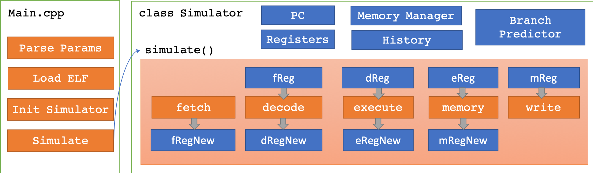

# <center>计算机组织与体系结构实习Lab 2</center>

## <center>RISC-V CPU模拟器设计与实现</center>

### 一、开发环境

#### 1.1 RISC-V环境的安装与配置

首先，必须搭建RISC-V相关的编译、运行和测试环境。简便起见，本次实验全部基于RISC-V 64I指令集，参考的指令集标准是RISC-V Specification 2.2。为了配置环境，执行了如下步骤。

1. 从GitHub上下载了`riscv-tools，`从中针对Linux平台配置，编译和安装了`riscv-gnu-toolchain`。
2. 为了使用官方模拟器作为参照，从GitHub上下载、编译和安装了`riscv-qemu`。

需要特别注意的是，在编译`riscv-gnu-toolchain`时，必须指定工具链和C语言标准库所使用的指令集为RV64I，否则在编译的时候编译器会使用RV64C、RV64D等扩展指令集。即使设置编译器编译时只使用RV64I指令集，编译器也会链接进使用扩展指令集的标准库函数。因此，为了获得只使用RV64I标准指令集的ELF程序，必须在`riscv-gnu-toolchain`中采用如下选项重新编译

```
mkdir build; cd build
../configure --with-arch=rv64i --prefix=/path/to/riscv64i
make -j$(nproc)
```

在编译时，使用`-march=rv64i`让编译器针对RV64I标准指令集生成ELF程序。

```
riscv64-unknown-elf-gcc -march=rv64i test/arithmetic.c test/lib.c -o riscv-elf/arithmetic.riscv
```

#### 1.2 使用的测试程序和测试方法

对一个体系结构模拟器进行测试有一定难度，主要是由于指令数众多、代码庞大、从而对模拟器代码进行100%覆盖率的测试比较困难。因此，为了便于测试，本模拟器使用了一组由简单到复杂的测试程序，并且实现了单步调试和打印CPU状态的接口。此外，为了便于进行调试和性能分析，还实现了记录执行历史的模块，在程序出错时可以获得完整的指令执行历史和内存快照，便于对出错进行分析。

为了对RISC-V模拟器进行测试，编写了如下程序（见`test/`文件夹）。比较复杂的是快速排序、矩阵乘法和求Ackermann函数三个。其中，快速排序和矩阵乘法涉及比较多的指令和数据，求解Ackermann函数涉及非常深的递归调用。

```
lib.c             # 自定义的系统调用实现
helloworld.c      # 最简单的程序
test_arithmetic.c # 对运算指令的测试
test_branch.c     # 对基本分支的测试
test_syscall.c    # 对系统调用的测试
quicksort.c       # 快速排序
matrixmulti.c     # 矩阵乘法
ackermann.c       # 求解Ackermann函数
```

所有程序编译后得到的二进制程序和反编译得到的汇编代码均保存在`riscv-elfs/`文件夹中。

### 二、设计概述

#### 2.1 开发环境

我测试的模拟器运行环境为Mac OS X，使用的编程语言为C++ 11，构建环境为CMake，编译器为`Apple Clang 10.0.0`，编译使用的Flag为`-O2 -Wall`。开发使用的工具为VS Code。不过，模拟器代码尽量避免了使用标准库以外的平台相关功能，所以应该也能在其他平台和编译器上编译运行。

#### 2.2 设计考量

首先，模拟器的运行必须是健壮的。具体地说，必须能够处理各种非法输入，包括不正常的访存，不正常的ELF文件，非法指令，非法的访存地址等等。编写细致全面的错误处理不仅有助于锻炼系统编程能力，也有助于在早期发现细微的程序错误。

其次，模拟器的实现必须简单、易于理解和易于调试。此模拟器是一个课程项目级别的模拟器，允许的实现时间有限，因此代码实现必须简单，调试系统必须完备，从而尽可能地减少编写程序和调试程序所需要的时间。

此外，模拟器实现的主要目的是能够被用于简单性能评测，因此必须能够尽可能贴近流水线硬件，并可以扩展出分支预测和缓存模拟等各种功能，便于在真正的程序上实验和评测流水线的性能，以及各种分支预测和缓存模拟策略。

本次模拟器的实现并不是要做一个成熟可用的工业级体系结构模拟器，也就是说，本次模拟器的实现并不注重性能和功能的全面性。在性能上，对于极端复杂和庞大的程序，模拟器的程序会执行缓慢，也有可能会消耗过多内存，对于模拟器本身的性能优化不在本实验的范围内。在功能上，为了实现简单，本模拟器使用自定义的系统调用，而不是兼容Linux的系统调用，因此，此模拟器只能运行专门为此编译的RISC-V程序（程序源码参见`test/`文件夹）。

#### 2.3 编译与运行

编译方法与一个典型的CMake项目一样，在编译之前必须先安装CMake。在Linux或者Mac OS X系统上可以采用如下命令

```
mkdir build
cd build
cmake ..
make
```

编译会得到可执行程序`Simulator`。该模拟器是一个命令行程序，在命令行上的执行方式是

```
./Simulator riscv-elf-file-name [-v] [-s] [-d] [-b param]
Parameters: 
        [-v] verbose output 
        [-s] single step
        [-d] dump memory and register trace to dump.txt
        [-b param] branch perdiction strategy, accepted param AT, NT, BTFNT, BPB
```

其中`riscv-elf-file-name`对应可执行的RISC-V ELF文件，比如`riscv-elf/`文件夹下的所有`*.riscv`文件。一个典型的运行流程和输出如下

```
hehaodeMacBook-Pro:build hehao$ ./Simulator ../riscv-elf/ackermann.riscv
Ackermann(0,0) = 1
Ackermann(0,1) = 2
Ackermann(0,2) = 3
Ackermann(0,3) = 4
Ackermann(0,4) = 5
Ackermann(1,0) = 2
Ackermann(1,1) = 3
Ackermann(1,2) = 4
Ackermann(1,3) = 5
Ackermann(1,4) = 6
Ackermann(2,0) = 3
Ackermann(2,1) = 5
Ackermann(2,2) = 7
Ackermann(2,3) = 9
Ackermann(2,4) = 11
Ackermann(3,0) = 5
Ackermann(3,1) = 13
Ackermann(3,2) = 29
Ackermann(3,3) = 61
Ackermann(3,4) = 125
Program exit from an exit() system call
------------ STATISTICS -----------
Number of Instructions: 430754
Number of Cycles: 574548
Avg Cycles per Instrcution: 1.3338
Branch Perdiction Accuacy: 0.5045 (Strategy: Always Not Taken)
Number of Control Hazards: 48010
Number of Data Hazards: 279916
Number of Memory Hazards: 47774
-----------------------------------
```

在默认的设置下，一开始会首先打印执行的程序的输出，然后会输出一组关于CPU执行情况的统计数据。

如果要进行单步调试的话，可以使用`-s`和`-v`参数

```
./Simulator ../riscv-elf/ackermann.riscv -s -v
```

得到的输出如下

```
hehaodeMacBook-Pro:build hehao$ ./Simulator ../riscv-elf/ackermann.riscv -s -v
==========ELF Information==========
Type: ELF64
Encoding: Little Endian
ISA: RISC-V(0xf3)
Number of Sections: 19
ID      Name            Address Size
[0]                     0x0     0
[1]     .text           0x100b0 3668
[2]     .rodata         0x10f08 29
[3]     .eh_frame       0x10f28 4
[4]     .init_array     0x11000 8
[5]     .fini_array     0x11008 8
[6]     .data           0x11010 1864
[7]     .sdata          0x11758 24
[8]     .sbss           0x11770 8
[9]     .bss            0x11778 72
[10]    .comment        0x0     26
[11]    .debug_aranges  0x0     48
[12]    .debug_info     0x0     46
[13]    .debug_abbrev   0x0     20
[14]    .debug_line     0x0     222
[15]    .debug_str      0x0     267
[16]    .symtab         0x0     2616
[17]    .strtab         0x0     913
[18]    .shstrtab       0x0     172
Number of Segments: 2
ID      Flags   Address FSize   MSize
[0]     0x5     0x10000 3884    3884
[1]     0x6     0x11000 1904    1984
===================================
Memory Pages: 
0x0-0x400000:
  0x10000-0x11000
  0x11000-0x12000
Fetched instruction 0x00002197 at address 0x100b0
Decode: Bubble
Execute: Bubble
Memory Access: Bubble
WriteBack: Bubble
------------ CPU STATE ------------
PC: 0x100b4
zero: 0x00000000(0) ra: 0x00000000(0) sp: 0x80000000(2147483648) gp: 0x00000000(0) 
tp: 0x00000000(0) t0: 0x00000000(0) t1: 0x00000000(0) t2: 0x00000000(0) 
s0: 0x00000000(0) s1: 0x00000000(0) a0: 0x00000000(0) a1: 0x00000000(0) 
a2: 0x00000000(0) a3: 0x00000000(0) a4: 0x00000000(0) a5: 0x00000000(0) 
a6: 0x00000000(0) a7: 0x00000000(0) s2: 0x00000000(0) s3: 0x00000000(0) 
s4: 0x00000000(0) s5: 0x00000000(0) s6: 0x00000000(0) s7: 0x00000000(0) 
s8: 0x00000000(0) s9: 0x00000000(0) s10: 0x00000000(0) s11: 0x00000000(0) 
t3: 0x00000000(0) t4: 0x00000000(0) t5: 0x00000000(0) t6: 0x00000000(0) 
-----------------------------------
Type d to dump memory in dump.txt, press ENTER to continue: 
```

在单步调试中，可以输入`d`来保存内存快照，使用ENTER前进到下一条指令。命令行显示的信息包括ELF信息、流水线状态和CPU寄存器状态。

使用`-v`参数并重定向标准输出可以得到关于流水线执行状态和寄存器状态的完整历史。

此外，可以使用`-b`参数指定不同的分支预测策略，例如

```
./Simulator ../riscv-elf/ackermann.riscv -b AT
./Simulator ../riscv-elf/ackermann.riscv -b NT
./Simulator ../riscv-elf/ackermann.riscv -b BTFNT
./Simulator ../riscv-elf/ackermann.riscv -b BPB
```

其中，AT表示Always Taken，NT表示Not Taken，BTFNT表示Back Taken Forward Not Taken，BPB表示Branch Prediction Buffer。

#### 2.4 代码架构



模拟器代码架构的概览图见上。模拟器的入口是`Main.cpp`，其中包含了解析参数、加载ELF文件、初始化模拟器的模块，并在最后调用模拟器的`simulate()`函数进入模拟器的执行。除非模拟器执行出错，否者`simulate()`函数理论上不会返回。

模拟器本身被设计成一个巨大的类，也就是代码中的`class Simulator`(参见`Simulator.h`、`Simulator.cpp`)。`Simulator`类中的数据包含了PC、通用寄存器、流水线寄存器、执行历史记录器、内存模块和分支预测模块，其中，由于内存模块和分支预测模块相对比较独立，因此实现为独立的两个类`MemoryManager`和`BranchPredictor`。

模拟器中最核心的函数是`simulate()`函数，这个函数对模拟器进行周期级模拟，每次模拟中，会执行`fetch()`、`decode()`、`execute()`、`accessMemory()`和`writeBack()`五个函数，每个函数会以上一个周期的流水线寄存器作为输入，并输出到下一个周期的流水线寄存器。在周期结束时，新的寄存器的内容会被拷贝到作为输入的寄存器中。在执行过程中，每个函数都会处理有关数据、控制和内存访问冒险的内容，并且在适当的地方记录历史信息。由于之间的交互关系比较复杂，因此在上图中并没有画出。由于相关函数代码过长，不便于在此贴出，因此关于实现的更多细节请参见`src/Simulator.cpp`。

### 三、具体设计和实现

#### 3.1 内存管理模块`MemoryManager`

`MemoryManager`的功能是为模拟器提供一个简单易使用的内存访问接口，必须支持任意内存大小、内存地址的访存，还要能检测到非法内存地址访问。事实上，这非常类似于操作系统中虚拟内存的机制。因此，`MemoryManager`的内部实现采用了类似x86体系结构中使用的二级页表的机制。具体地说，将32位内存空间在逻辑上划分为大小为4KB(2^12)的页，并且采用内存地址的前10位作为一级页表的索引，紧接着10位作为二级页表的索引，最后12位作为一个内存页里的下标。

页表结构可以如下声明

```c++
uint8_t **memory[1024];
```

其中，`memory`指向一个长度为1024的一级页表数组，`memory[i]`指向长度为1024的二级页表数组，`memory[i][j]`指向具体的内存页，`memory[i][j][k]`可以取出内存地址为`(i<<22)|(j<<12)|k`的一个字节。可以在需要的时候对`memory`进行动态内存分配和释放。模拟器对`memory`的一个访存过程的示例如下

```c++
uint8_t MemoryManager::getByte(uint32_t addr) {
  if (!this->isAddrExist(addr)) {
    dbgprintf("Byte read to invalid addr 0x%x!\n", addr);
    return false;
  }
  uint32_t i = this->getFirstEntryId(addr);
  uint32_t j = this->getSecondEntryId(addr);
  uint32_t k = this->getPageOffset(addr);
  return this->memory[i][j][k];
}
```

关于`MemoryManager`实现的更多信息，参见`src/MemoryManager.cpp`。

#### 3.2 可执行文件的装载、初始化

本模拟器的可执行文件加载部分采用了GitHub上的开源库ELFIO(https://github.com/serge1/ELFIO)，由于这个库只有头文件，所以导入工程相当容易，相关头文件在`include/`文件夹下。

使用这个库进行ELF文件加载相当容易

```c++
// Read ELF file
ELFIO::elfio reader;
if (!reader.load(elfFile)) {
  fprintf(stderr, "Fail to load ELF file %s!\n", elfFile);
  return -1;
}
```

加载ELF文件进内存的代码如下，直接按照ELF文件头的信息将每个数据段拷贝到指定的内存位置即可，唯一需要注意的是文件内数据长度可能小于指定的内存长度，需要用0填充。值得一提的是本模拟器在设计时并未考虑支持32位以上的内存，因为内存占用如此之大的用户程序是比较罕见的，在我们用的测试程序中不会出现这种情况。

```c++
void loadElfToMemory(ELFIO::elfio *reader, MemoryManager *memory) {
  ELFIO::Elf_Half seg_num = reader->segments.size();
  for (int i = 0; i < seg_num; ++i) {
    const ELFIO::segment *pseg = reader->segments[i];

    uint64_t fullmemsz = pseg->get_memory_size();
    uint64_t fulladdr = pseg->get_virtual_address();
    // Our 32bit simulator cannot handle this
    if (fulladdr + fullmemsz > 0xFFFFFFFF) {
      dbgprintf(
          "ELF address space larger than 32bit! Seg %d has max addr of 0x%lx\n",
          i, fulladdr + fullmemsz);
      exit(-1);
    }

    uint32_t filesz = pseg->get_file_size();
    uint32_t memsz = pseg->get_memory_size();
    uint32_t addr = (uint32_t)pseg->get_virtual_address();

    for (uint32_t p = addr; p < addr + memsz; ++p) {
      if (!memory->isPageExist(p)) {
        memory->addPage(p);
      }

      if (p < addr + filesz) {
        memory->setByte(p, pseg->get_data()[p - addr]);
      } else {
        memory->setByte(p, 0);
      }
    }
  }
}
```

最后，需要在模拟器初始化时手动设置PC的值。模拟器还需要很多其他的初始化操作，具体可以参考`src/Main.cpp`。

```c++
simulator.pc = reader.get_entry();
```

#### 3.3 指令语义的解析和控制信号的处理

本小节中涉及代码由于普遍过长，且存在非常强的相互依赖，单独贴出可能难以理解，因此不会在此直接贴出代码，具体内容请参见`src/Simulator.cpp`。

指令的取值过程参见`Simulator::fetch()`函数，由于RV64I指令集都是4字节定长，所以实现起来非常简单。

指令的解码过程参见`Simulator::decode()`函数，其中绝大多数内容都是对RISC-V Specification 2.2中规定的指令编码的直接翻译。在解码过程中，为了便于调试，`decode()`函数会按照RISC-V汇编格式翻译出指令字符串。此外，`decode`函数会模仿硬件实现在指令中抽象出`op1`、`op2`、`dest`等几个共有的域。分支预测模块会在解码阶段做出预测判断。

指令的执行过程参见`Simulator::execute()`函数，这个函数简单粗暴地根据指令类型直接执行相应的行为。在结尾，会根据当前指令和解码阶段的情况，检测数据冒险、控制冒险和内存访问冒险，并作出相应的操作。在这个阶段，跳转指令会得到是否跳转的结果，并在预测错误的情况下在流水线寄存器中插入对应的Bubble。

指令的访存过程参见`Simulator::memoryAccess()`函数，这个函数首先执行内存读写操作，并且检测数据冒险和转发数据。在检测数据冒险时，既需要考虑到一般的数据冒险，也必须考虑到上个周期因为内存访问冒险而流水线Stall的情况，此外，也必须考虑数据转发的优先级，`memoryAccess()`作为后面的指令，数据转发的优先级是低于`execute()`的，否则可能会出现较老的数据被转发并覆盖新数据的情况。

指令的写回过程参见`Simulator::writeBack()`函数，这个函数将执行结果写回寄存器，并且类似之前的情况处理相关的数据冒险。

流水线寄存器的控制信号设置如下，注意其中fReg表示的是下一个周期开始时，从取值阶段传输到解码阶段的数据，以此类推。

| 出现的情况   | fReg   | dReg   | eReg   | mReg   |
| ------------ | ------ | ------ | ------ | ------ |
| 分支预测错误 | Bubble | Bubble | Normal | Normal |
| 内存访问冒险 | Stall  | Stall  | Bubble | Normal |
| 预测跳转     | Bubble | Normal | Normal | Normal |

有一种情况需要特别说明，就是分支预测器的情况。在当前的模拟器设计中，由于到了解码阶段结束才得知跳转指令的存在，因此如果预测跳转的话必须向流水线中插入一个Bubble，才能确保取指阶段取出的是跳转后的指令。这不会增加分支预测错误的开销，但是会使得预测正确的开销多了一个周期。如果要改进这个设计的话，必须将分支预测模块转移到取指阶段实现。

#### 3.4 系统调用和库函数接口的处理

本模拟器使用自定义的系统调用接口。系统调用的`ecall`指令会使用`a0`和`a7`寄存器，其中`a7`寄存器保存的是系统调用号，`a0`寄存器保存的是系统调用参数，返回值会保存在`a0`寄存器中。为了能让系统调用指令能被集成进当前的流水线，`ecall`指令只支持一个返回值和一个参数。所有系统调用的语义见下表。

| 系统调用名称 | 系统调用号 | 参数           | 返回值     |
| ------------ | ---------- | -------------- | ---------- |
| 输出字符串   | 0          | 字符串起始地址 | 无         |
| 输出字符     | 1          | 字符的值       | 无         |
| 输出数字     | 2          | 数字的值       | 无         |
| 退出程序     | 3          | 无             | 无         |
| 读入字符     | 4          | 无             | 读入的字符 |
| 读入数字     | 5          | 无             | 读入的数字 |

对应的系统调用接口如下

```c
void print_d(int num);
void print_s(const char *str);
void print_c(char ch);
void exit_proc();
char read_char();
long long read_num();
```

具体的实现需要使用内联汇编，请参考`test/lib.c`。

#### 3.5 性能计数相关模块

在当前模拟器架构下，对于模拟器进行性能统计只需在代码里适当的地方加入统计代码即可。数据统计模块的定义如下

```c++
struct History {
  uint32_t instCount;
  uint32_t cycleCount;
  uint32_t predictedBranch; // Number of branch that is predicted successfully
  uint32_t unpredictedBranch; // Number of branch that is not predicted successfully
  uint32_t dataHazardCount;
  uint32_t controlHazardCount;
  uint32_t memoryHazardCount;
  std::vector<std::string> instRecord;
  std::vector<std::string> regRecord;
  std::string memoryDump;
} history;
```

其中，最后三个数据项用于记载CPU的执行历史，便于在调试的时候使用。为了防止模拟器占用过多内存，`instRecord`和`regRecord`当内容多于100000条时会被清空，`memoryDump`只会在要求生成内存快照时被使用。

#### 3.6 调试接口

由于对CPU模拟器的调试相对比较困难，CPU模拟器的调试接口和错误执行接口必须被非常小心地设计，以便于尽可能早地发现程序中的Bug。在当前模拟器的代码中，存在大量对模拟器状态和输入值合法性的检查，以便尽可能早地发现错误。`Simulator`类中存在专门的错误处理函数`panic()`。

```c++
void Simulator::panic(const char *format, ...) {
  char buf[BUFSIZ];
  va_list args;
  va_start(args, format);
  vsprintf(buf, format, args);
  fprintf(stderr, "%s", buf);
  va_end(args);
  this->dumpHistory();
  fprintf(stderr, "Execution history and memory dump in dump.txt\n");
  exit(-1);
}
```

此外，模拟器还支持单步调试和`verbose`输出的功能，使用`-s`和`-v`参数即可开启单步调试模式。使用`-v`参数并重定向标准输出可以得到寄存器状态和流水线状态的完整执行历史并在事后进行分析。一条典型的CPU执行状态记录如下

```
Fetched instruction 0x00000593 at address 0x100c4
Decoded instruction 0x40a60633 as sub a2,a2,a0
Execute: addi
  Forward Data a2 to Decode op1
Memory Access: addi
  Forward Data a0 to Decode op2
WriteBack: addi
------------ CPU STATE ------------
PC: 0x100c8
zero: 0x00000000(0) ra: 0x00000000(0) sp: 0x80000000(2147483648) gp: 0x00011f58(73560) 
tp: 0x00000000(0) t0: 0x00000000(0) t1: 0x00000000(0) t2: 0x00000000(0) 
s0: 0x00000000(0) s1: 0x00000000(0) a0: 0x00000000(0) a1: 0x00000000(0) 
a2: 0x00000000(0) a3: 0x00000000(0) a4: 0x00000000(0) a5: 0x00000000(0) 
a6: 0x00000000(0) a7: 0x00000000(0) s2: 0x00000000(0) s3: 0x00000000(0) 
s4: 0x00000000(0) s5: 0x00000000(0) s6: 0x00000000(0) s7: 0x00000000(0) 
s8: 0x00000000(0) s9: 0x00000000(0) s10: 0x00000000(0) s11: 0x00000000(0) 
t3: 0x00000000(0) t4: 0x00000000(0) t5: 0x00000000(0) t6: 0x00000000(0) 
-----------------------------------
```

#### 3.7 实现中遇到的坑

在整个实现中，我在第一阶段的单周期指令级模拟的实现并没有遇到什么问题，但是流水线相关的模拟中，遇到了几个相当微妙的错误。

1. 一个根本的困难在于我们对流水线的模拟程序本质上还是线性执行的，并不能像硬件那样多阶段并行执行。因此，必须非常小心地设计五个阶段的代码的执行流和对数据结构的访问，才能模拟出硬件的效果。
2. 当多个阶段发现数据冒险并向前转发数据时，必须优先传送更新的数据。在模拟器中，由于相关阶段的执行顺序是执行->访存->写回，因此会存在前面的阶段向前转发的数据被后面的阶段的旧数据覆盖的可能。对于这种情况，模拟器中必须加以特别的判定。
3. 分支预测模块应当在解码阶段根据预测结果修改PC的值，但是，如果这个跳转指令是被错误取进来，并且应该在之后被Bubble的话怎么办？必须想办法恢复被修改的PC值，或者延迟写入预测的PC值。
4. 也是由于代码是顺序执行的，因此当执行阶段发现访存指令，而解码阶段的指令依赖访存数据并导致内存冒险时，必须非常小心地设计整个执行过程和数据访问流程，才能模拟出正确的结果。
5. 用于系统调用的`ecall`指令也会导致数据冒险！并且产生数据冒险的条目，取决于这个系统调用的参数数量和其对应的寄存器！当前的系统调用会依赖的寄存器有`a0`和`a7`两个，因此刚好能作为`op1`和`op2`塞入流水线，但是如果系统调用需要的参数更多，实现将会变得更为复杂。
6. `zero`寄存器是一个相当独特的存在，理论上他任何时候值应该都是0，所以进行数据转发的时候必须处处特判零寄存器，如果向零寄存器里的值进行数据转发就会导致非常难以发现的错误。

### 四、功能测试与性能评测

#### 4.1 模拟器的功能正确性测试

我自己编写的测试程序见下表，注意所有的程序都需要和`test/lib.c`一起编译。

| 代码文件                 | 对应的ELF文件                     |
| ------------------------ | --------------------------------- |
| `test/helloworld.c`      | `riscv-elf/helloworld.riscv`      |
| `test/test_arithmetic.c` | `riscv-elf/test_arithmetic.riscv` |
| `test/test_syscall.c`    | `riscv-elf/test_syscall.riscv`    |
| `test/test_branch.c`     | `riscv-elf/test_branch.riscv`     |
| `test/quicksort.c`       | `riscv-elf/quicksort.riscv`       |
| `test/matrixmulti.c`     | `riscv-elf/matrixmulti.riscv`     |
| `test/ackermann.c`       | `riscv-elf/ackermann.riscv`       |

每个代码文件的功能描述如下

| 代码文件                 | 功能描述                        |
| ------------------------ | ------------------------------- |
| `test/helloworld.c`      | 最简单的Hello, World            |
| `test/test_arithmetic.c` | 测试一组算术运算                |
| `test/test_syscall.c`    | 测试全部的系统调用              |
| `test/test_branch.c`     | 测试条件和循环语句              |
| `test/quicksort.c`       | 分别对10和100个元素进行快速排序 |
| `test/matrixmulti.c`     | 10*10矩阵乘法                   |
| `test/ackermann.c`       | 求解一组Ackermann函数的值       |

如果模拟器程序`Simulator`在项目中的`build/`目录下，可以运行如下命令，得到运行结果，来验证模拟器的正确性。注意`test_syscall.riscv`程序中存在用户输入的部分。

```
./Simulator ../riscv-elf/helloworld.riscv
./Simulator ../riscv-elf/test_arithmetic.riscv
./Simulator ../riscv-elf/test_syscall.riscv
./Simulator ../riscv-elf/test_branch.riscv
./Simulator ../riscv-elf/quicksort.riscv
./Simulator ../riscv-elf/matrixmulti.riscv
./Simulator ../riscv-elf/ackermann.riscv
```

得到的执行结果如下

```
hehaodeMacBook-Pro:build hehao$ ./Simulator ../riscv-elf/helloworld.riscv
Hello, World!
Program exit from an exit() system call
------------ STATISTICS -----------
Number of Instructions: 141
Number of Cycles: 188
Avg Cycles per Instrcution: 1.3333
Branch Perdiction Accuacy: 0.5833 (Strategy: Always Not Taken)
Number of Control Hazards: 23
Number of Data Hazards: 73
Number of Memory Hazards: 1
-----------------------------------
hehaodeMacBook-Pro:build hehao$ ./Simulator ../riscv-elf/test_arithmetic.riscv
30
-10
370350
411
49380
771
Program exit from an exit() system call
------------ STATISTICS -----------
Number of Instructions: 508
Number of Cycles: 703
Avg Cycles per Instrcution: 1.3839
Branch Perdiction Accuacy: 0.4268 (Strategy: Always Not Taken)
Number of Control Hazards: 91
Number of Data Hazards: 224
Number of Memory Hazards: 13
-----------------------------------
hehaodeMacBook-Pro:build hehao$ ./Simulator ../riscv-elf/test_syscall.riscv
This is string from print_s()
123456abc
Enter a number: 123456
The number is: 123456
Enter a character: g
The character is: g
Program exit from an exit() system call
------------ STATISTICS -----------
Number of Instructions: 350
Number of Cycles: 461
Avg Cycles per Instrcution: 1.3171
Branch Perdiction Accuacy: 0.5833 (Strategy: Always Not Taken)
Number of Control Hazards: 53
Number of Data Hazards: 178
Number of Memory Hazards: 5
-----------------------------------
hehaodeMacBook-Pro:build hehao$ ./Simulator ../riscv-elf/quicksort.riscv
Prev A: 5 3 5 6 7 1 3 5 6 1 
Sorted A: 1 1 3 3 5 5 5 6 6 7 
Prev B: 100 99 98 97 96 95 94 93 92 91 90 89 88 87 86 85 84 83 82 81 80 79 78 77 76 75 74 73 72 71 70 69 68 67 66 65 64 63 62 61 60 59 58 57 56 55 54 53 52 51 50 49 48 47 46 45 44 43 42 41 40 39 38 37 36 35 34 33 32 31 30 29 28 27 26 25 24 23 22 21 20 19 18 17 16 15 14 13 12 11 10 9 8 7 6 5 4 3 2 1 
Sorted B: 1 2 3 4 5 6 7 8 9 10 11 12 13 14 15 16 17 18 19 20 21 22 23 24 25 26 27 28 29 30 31 32 33 34 35 36 37 38 39 40 41 42 43 44 45 46 47 48 49 50 51 52 53 54 55 56 57 58 59 60 61 62 63 64 65 66 67 68 69 70 71 72 73 74 75 76 77 78 79 80 81 82 83 84 85 86 87 88 89 90 91 92 93 94 95 96 97 98 99 100 
Program exit from an exit() system call
------------ STATISTICS -----------
Number of Instructions: 103671
Number of Cycles: 141697
Avg Cycles per Instrcution: 1.3668
Branch Perdiction Accuacy: 0.4926 (Strategy: Always Not Taken)
Number of Control Hazards: 7314
Number of Data Hazards: 86448
Number of Memory Hazards: 23398
-----------------------------------
hehaodeMacBook-Pro:build hehao$ ./Simulator ../riscv-elf/matrixmulti.riscv
The content of A is: 
0 0 0 0 0 0 0 0 0 0 
1 1 1 1 1 1 1 1 1 1 
2 2 2 2 2 2 2 2 2 2 
3 3 3 3 3 3 3 3 3 3 
4 4 4 4 4 4 4 4 4 4 
5 5 5 5 5 5 5 5 5 5 
6 6 6 6 6 6 6 6 6 6 
7 7 7 7 7 7 7 7 7 7 
8 8 8 8 8 8 8 8 8 8 
9 9 9 9 9 9 9 9 9 9 
The content of B is: 
0 1 2 3 4 5 6 7 8 9 
0 1 2 3 4 5 6 7 8 9 
0 1 2 3 4 5 6 7 8 9 
0 1 2 3 4 5 6 7 8 9 
0 1 2 3 4 5 6 7 8 9 
0 1 2 3 4 5 6 7 8 9 
0 1 2 3 4 5 6 7 8 9 
0 1 2 3 4 5 6 7 8 9 
0 1 2 3 4 5 6 7 8 9 
0 1 2 3 4 5 6 7 8 9 
The content of C=A*B is: 
0 0 0 0 0 0 0 0 0 0 
0 10 20 30 40 50 60 70 80 90 
0 20 40 60 80 100 120 140 160 180 
0 30 60 90 120 150 180 210 240 270 
0 40 80 120 160 200 240 280 320 360 
0 50 100 150 200 250 300 350 400 450 
0 60 120 180 240 300 360 420 480 540 
0 70 140 210 280 350 420 490 560 630 
0 80 160 240 320 400 480 560 640 720 
0 90 180 270 360 450 540 630 720 810 
Program exit from an exit() system call
------------ STATISTICS -----------
Number of Instructions: 225441
Number of Cycles: 318532
Avg Cycles per Instrcution: 1.4129
Branch Perdiction Accuacy: 0.3765 (Strategy: Always Not Taken)
Number of Control Hazards: 40678
Number of Data Hazards: 110957
Number of Memory Hazards: 11735
-----------------------------------
hehaodeMacBook-Pro:build hehao$ ./Simulator ../riscv-elf/ackermann.riscv
Ackermann(0,0) = 1
Ackermann(0,1) = 2
Ackermann(0,2) = 3
Ackermann(0,3) = 4
Ackermann(0,4) = 5
Ackermann(1,0) = 2
Ackermann(1,1) = 3
Ackermann(1,2) = 4
Ackermann(1,3) = 5
Ackermann(1,4) = 6
Ackermann(2,0) = 3
Ackermann(2,1) = 5
Ackermann(2,2) = 7
Ackermann(2,3) = 9
Ackermann(2,4) = 11
Ackermann(3,0) = 5
Ackermann(3,1) = 13
Ackermann(3,2) = 29
Ackermann(3,3) = 61
Ackermann(3,4) = 125
Program exit from an exit() system call
------------ STATISTICS -----------
Number of Instructions: 430754
Number of Cycles: 574548
Avg Cycles per Instrcution: 1.3338
Branch Perdiction Accuacy: 0.5045 (Strategy: Always Not Taken)
Number of Control Hazards: 48010
Number of Data Hazards: 279916
Number of Memory Hazards: 47774
-----------------------------------
```

#### 4.2 运行给定的5个测试程序

##### 4.2.1 原始的执行结果

给定的5个程序在`test-inclass/`文件夹中，有如下5个

```
add.c
mul-div.c
n!.c
qsort.c
simple-function.c
```

类似之前的执行方式，得到如下原始运行结果

```
hehaodeMacBook-Pro:build hehao$ ./Simulator ../test-inclass/add.riscv
Program exit from an exit() system call
------------ STATISTICS -----------
Number of Instructions: 876
Number of Cycles: 1183
Avg Cycles per Instrcution: 1.3505
Branch Perdiction Accuacy: 0.4639 (Strategy: Always Not Taken)
Number of Control Hazards: 124
Number of Data Hazards: 433
Number of Memory Hazards: 58
-----------------------------------
hehaodeMacBook-Pro:build hehao$ ./Simulator ../test-inclass/mul-div.riscv
Program exit from an exit() system call
------------ STATISTICS -----------
Number of Instructions: 901
Number of Cycles: 1208
Avg Cycles per Instrcution: 1.3407
Branch Perdiction Accuacy: 0.4639 (Strategy: Always Not Taken)
Number of Control Hazards: 124
Number of Data Hazards: 463
Number of Memory Hazards: 58
-----------------------------------
hehaodeMacBook-Pro:build hehao$ ./Simulator ../test-inclass/n\!.riscv
Program exit from an exit() system call
------------ STATISTICS -----------
Number of Instructions: 1112
Number of Cycles: 1525
Avg Cycles per Instrcution: 1.3714
Branch Perdiction Accuacy: 0.4661 (Strategy: Always Not Taken)
Number of Control Hazards: 189
Number of Data Hazards: 515
Number of Memory Hazards: 34
-----------------------------------
hehaodeMacBook-Pro:build hehao$ ./Simulator ../test-inclass/qsort.riscv
Program exit from an exit() system call
------------ STATISTICS -----------
Number of Instructions: 19427
Number of Cycles: 25328
Avg Cycles per Instrcution: 1.3038
Branch Perdiction Accuacy: 0.4701 (Strategy: Always Not Taken)
Number of Control Hazards: 1363
Number of Data Hazards: 14156
Number of Memory Hazards: 3174
-----------------------------------
hehaodeMacBook-Pro:build hehao$ ./Simulator ../test-inclass/simple-function.riscv
Program exit from an exit() system call
------------ STATISTICS -----------
Number of Instructions: 886
Number of Cycles: 1197
Avg Cycles per Instrcution: 1.3510
Branch Perdiction Accuacy: 0.4639 (Strategy: Always Not Taken)
Number of Control Hazards: 126
Number of Data Hazards: 438
Number of Memory Hazards: 58
-----------------------------------
```

从这些原始数据中可以分析得到要求的结果，下面会对这些结果进行总结。

##### 4.2.2 动态执行的指令数

| 程序名                  | 执行的指令数 |
| ----------------------- | ------------ |
| `add.riscv`             | 876          |
| `mul-div.riscv`         | 901          |
| `n!.riscv`              | 1112         |
| `qsort.riscv`           | 19427        |
| `simple-function.riscv` | 886          |

##### 4.2.3 执行周期数和平均CPI

| 程序名                  | 执行周期数 | 平均CPI |
| ----------------------- | ---------- | ------- |
| `add.riscv`             | 1183       | 1.3505  |
| `mul-div.riscv`         | 1208       | 1.3407  |
| `n!.riscv`              | 1525       | 1.3714  |
| `qsort.riscv`           | 25328      | 1.3038  |
| `simple-function.riscv` | 1197       | 1.3510  |

可以发现，对于各种类型的程序，本模拟器流水线实现的平均CPI在1.33左右，和单周期相比能实现大约3.76倍的指令吞吐量。

##### 4.2.4 不同类型的冒险统计 

| 程序名                  | 数据冒险 | 控制冒险 | 内存访问冒险 |
| ----------------------- | -------- | -------- | ------------ |
| `add.riscv`             | 433      | 124      | 58           |
| `mul-div.riscv`         | 463      | 124      | 58           |
| `n!.riscv`              | 515      | 189      | 34           |
| `qsort.riscv`           | 14156    | 1363     | 3174         |
| `simple-function.riscv` | 438      | 126      | 58           |

### 五、其它内容

#### 5.1 分支预测模块

分支预测模块是一个相对比较独立的模块，因此单独实现为`BranchPredictor`类。`BranchPredictor`类需要指定一个分支预测有关的策略，并保存与这个策略有关的数据结构。本模拟器实现了如下几种策略

| 策略名称 | 策略说明                     |
| -------- | ---------------------------- |
| NT       | Always Not Taken             |
| AT       | Always Taken                 |
| BTFNT    | Back Taken Forward Not Taken |
| BPB      | Branch Prediction Buffer     |

其中，Branch Prediction Buffer采用"Computer Organization and Design: Hardware/Software Interface"中所介绍的四状态，两位历史信息的方法。具体地说，使用内存后12位作为索引维护一个长度为4096的直接映射高速缓存，用于存储分支指令的地址。对于一个缓存条目，其状态为以下四个状态之一：`Strong Taken`, `Weak Taken`, `Weak Not Taken`, `Strong Not Taken`. 状态转换图如下


具体实现如下

```c++
bool BranchPredictor::predict(uint32_t pc, uint32_t insttype, int64_t op1,
                              int64_t op2, int64_t offset) {
  switch (this->strategy) {
  case NT:
    return false;
  case AT:
    return true;
  case BTFNT: {
    if (offset >= 0) {
      return false;
    } else {
      return true;
    }
  }
  break;
  case BPB: {
    PredictorState state = this->predbuf[pc % PRED_BUF_SIZE];
    if (state == STRONG_TAKEN || state == WEAK_TAKEN) {
      return true;
    } else if (state == STRONG_NOT_TAKEN || state == WEAK_NOT_TAKEN) {
      return false;
    } else {
      dbgprintf("Strange Prediction Buffer!\n");
    }   
  }
  break;
  default:
    dbgprintf("Unknown Branch Perdiction Strategy!\n");
    break;
  }
  return false;
}

void BranchPredictor::update(uint32_t pc, bool branch) {
  int id = pc % PRED_BUF_SIZE;
  PredictorState state = this->predbuf[id];
  if (branch) {
    if (state == STRONG_NOT_TAKEN) {
      this->predbuf[id] = WEAK_NOT_TAKEN;
    } else if (state == WEAK_NOT_TAKEN) {
      this->predbuf[id] = WEAK_TAKEN;
    } else if (state == WEAK_TAKEN) {
      this->predbuf[id] = STRONG_TAKEN;
    } // do nothing if STRONG_TAKEN
  } else { // not taken
    if (state == STRONG_TAKEN) {
      this->predbuf[id] = WEAK_TAKEN;
    } else if (state == WEAK_TAKEN) {
      this->predbuf[id] = WEAK_NOT_TAKEN;
    } else if (state == WEAK_NOT_TAKEN) {
      this->predbuf[id] = STRONG_NOT_TAKEN;
    } // do noting if STRONG_NOT_TAKEN
  }
}
```

并且在解码阶段和执行阶段添加有关分支预测的代码

```c++
// Sumulator::decode()
bool predictedBranch = false;
if (isBranch(insttype)) {
  predictedBranch = this->branchPredictor->predict(this->fReg.pc, insttype,
                                                   op1, op2, offset);
  if (predictedBranch) {
    this->predictedPC = this->fReg.pc + offset;
    this->anotherPC = this->fReg.pc + 4;
    this->fRegNew.bubble = true;
  } else {
     this->anotherPC = this->fReg.pc + offset;
  }
}
```

```c++
// Simulator::execute()
if (isBranch(inst)) {
  ...
  // this->dReg.pc: fetch original inst addr, not the modified one
  this->branchPredictor->update(this->dReg.pc, branch);
}
```

需要注意的是将PC修改为预测器预测的PC的时机，必须要在一个周期的结束时，也就是`simulate()`函数中循环的末尾处。

```c++
// The Branch perdiction happens here to avoid strange bugs in branch prediction
if (!this->dReg.bubble && !this->dReg.stall && !this->fReg.stall && this->dReg.predictedBranch) {
  this->pc = this->predictedPC;
}
```

这样即可完成分支预测模块的实现，并且很容易能够扩展出新的分支预测策略。

#### 5.2 分支预测模块的性能评测

有趣的是，有了这个分支预测模块之后，我们可以对不同分支预测策略的性能进行评测。下面的表格是一个对分支预测准确率的简单统计。

| 评测程序           | Always Taken | BTFNT  | Prediction Buffer |
| ------------------ | ------------ | ------ | ----------------- |
| `helloworld.riscv` | 0.4706       | 0.7059 | 0.4706            |
| `quicksort.riscv`  | 0.5075       | 0.9506 | 0.9587            |
| `matrixmult.riscv` | 0.6235       | 0.6325 | 0.6275            |
| `ackermann.riscv`  | 0.4955       | 0.5053 | 0.9593            |

我们可以看到，对于`helloworld`程序，由于程序过于简单，其中绝大多数指令只会被执行一次，所以基于历史信息的Prediction Buffer方法退化到了Always Taken方法(因为默认预测是选择跳转)，而基于程序结构的经验性判断方法BTFNT反而取得了最高的准确率。

对于快速排序评测程序，我们发现Prediction Buffer和BTFNT都取得了极其高的预测准确率。这是因为排序元素较多(100个)，并且绝大多数情况下都在反复执行很少的一段代码。由于这些代码绝大多数都满足向前会跳转的性质，所以BTFNT方法的准确率很高。由于循环的执行长度非常长(约100次)，所以基于历史信息的Predicton Buffer能够很好地获得较高的预测准确性。

对于矩阵乘法程序，三个分支预测算法的表现非常接近。这可能是由于矩阵乘法中每次循环的执行长度都很短(10个元素)，限制了BTFNT和Prediction Buffer的性能。

对于Ackermann函数求解程序，其中完全没有循环语句，只有函数递归调用和条件判断语句，绝大多数的分支指令都在递归调用的函数内，因此，这时基于历史信息的Prediction Buffer就能发挥出最大威力，得出相当高的预测准确率，而BTFNT在此则相对比较受限了，如果递归函数内刚好两个if语句，一个if语句是向前跳转，一个if语句是向后跳转，而两条语句在大多数情况下都是跳转，那么BTFNT的准确率就会在50%左右徘徊。

#### 5.3 意见和建议

1. 编写RISC-V CPU模拟器极大地锻炼了我的系统编程能力。虽然在编写的过程中遇到了一些难以解决的Bug，但在解决它们的过程中，使我收获了很多Debug经验，并且更加深刻地认识到了编写健壮和包含完备错误处理程序的重要性。
2. 在配置RISC-V环境的过程中，我发现RISC-V工具链存在一些文档缺失的问题，有时会遇到默认配置比较奇怪或者一些参数过时的问题，为安装相关工具造成了一些困难。我希望要是能在每次Lab发布前，能给出配置环境的一些有关教程就更好了。
3. 计算机体系结构课教的体系结构是MIPS，不知道为什么Lab却要做RISC-V，有一点增加了学习成本和完成Lab的时间。