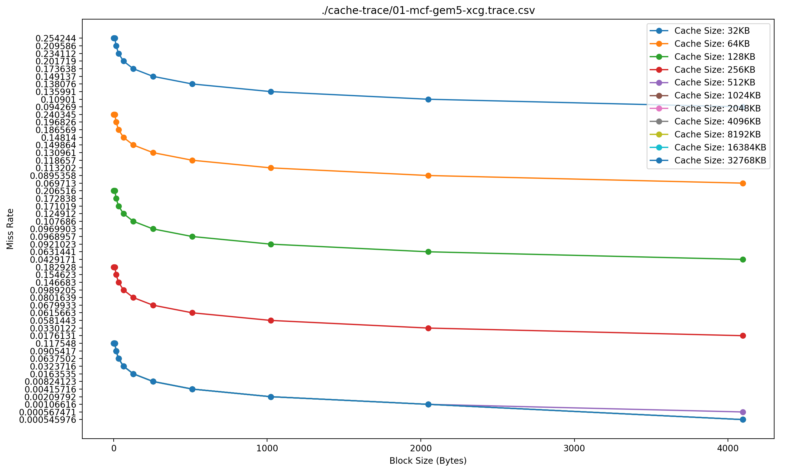
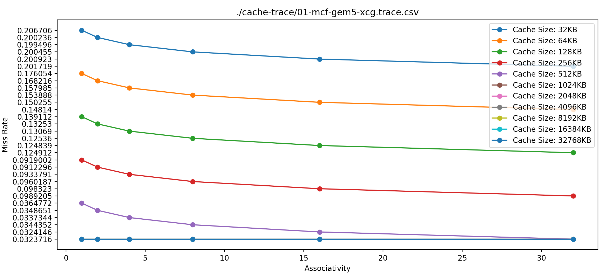
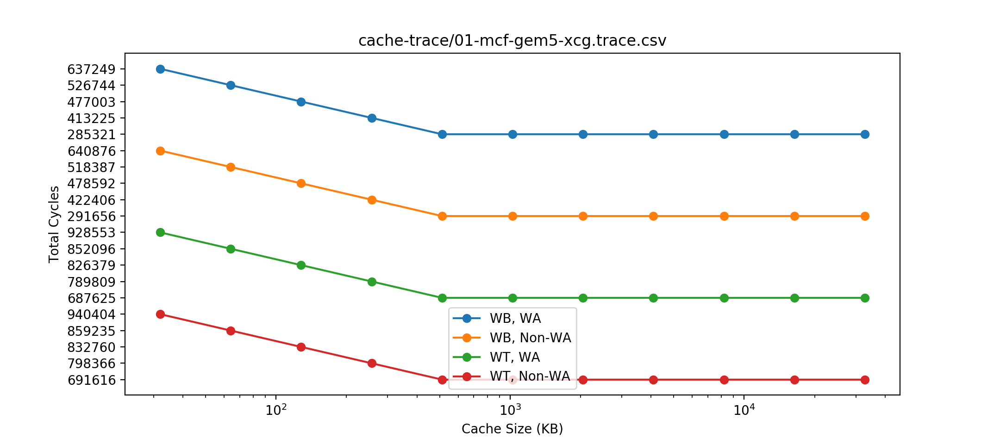

# <center>计算机组织与体系结构Lab 3</center>

## <center>高速缓存的模拟、配置和优化</center>

## 一、单级Cache模拟

由于本次Lab第二阶段需要与CPU模拟器联调，考虑到实现和集成的方便，故编写了自己的缓存模拟模块，涉及到的源文件如下

| 文件名                | 功能                                                      |
| --------------------- | --------------------------------------------------------- |
| `src/Cache.h`           | Cache类的声明，Cache类是模拟一级缓存的类                  |
| `src/Cache.cpp`         | Cache类的具体实现                                         |
| `src/MemoryManager.h`   | MemoryManager类的声明，MemoryManager类用于和CPU模拟器交互 |
| `src/MemoryManager.cpp` | MemoryManager类的具体实现                                 |
| `src/MainCache.cpp`     | MainCache是单级Cache模拟程序的入口                        |

`src/MainCache.cpp`程序负责读入访存Trace文件，并模拟不同Cache条件下缓存运行情况。模拟的缓存大小范围是32KB~32MB；Block Size范围是1Byte~4096Byte(4096Byte的上限是由于模拟器虚拟内存系统的页大小为4KB)；Associativity的范围是1~32；对于每个上述条件，分别模拟了Write Through, Write Back, Write Allocate和Non-Write Allocate情况。使用的替换算法是LRU。对于每种情况，统计了此种情况下的Miss Rate和总访问延时。两个Trace的缓存模拟情况统计结果分别存储于`cache-trace/01-mcf-gem5-xcg.trace.csv`和`cache-trace/02-stream-gem5-xaa.trace.csv`。

### 1. Miss Rate随Block Size的变化



图中画出了在不同的 Cache Size( 32KB ~ 32MB)的条件下， Miss Rate 随 Block Size变化的趋势。可以看到，对于所有的Cache Size情况，Miss Rate会随着Block Size的提升而降低，但是当Block Size提升到一定程度时会趋于稳定。极端情况下，当Block Size非常大，使得Block数量变得很少的时候，Miss Rate就会不降反升。

### 2. Miss Rate随Associativity的变化

固定Block Size为64Byte，下图中画出了随着Associativity改变，Miss Rate的情况。



图中画出了在不同Cache Size下，固定Line Size为64Byte，Associativity随着Miss Rate改变的变化情况。可以看到，当Cache Size不够大时，Miss Rate随着Associativity的增加而降低。当Cache Size足够大时，Miss Rate与Associativity无关。

### 3. Write Through，Write Back ，Write Allocate和Non-Write Allocate的访问延时差异



图中画出了在不同写策略下总的访问延时。可以看到，Write Back的访问延时远低于Write Through。在同样是Write Back或同样是Write Through的情况下，Write Allocate的访问延时略低于Non-Write Allocate。

## 二、与CPU模拟器联调

通过修改Lab 2中所实现的`Simulator`和`MemoryManager`，可以实现Cache与CPU模拟器的联调。Cache的配置如下

| Level | Capacity | Associativity | Block Size | Write Policy | Hit Latency  |
| ----- | -------- | ------------- | ---------- | ------------ | ------------ |
| L1    | 32KB     | 8 ways        | 64         | Write Back   | 1 CPU Cycle  |
| L2    | 256KB    | 8 ways        | 64         | Write Back   | 8 CPU Cycle  |
| LLC   | 8MB      | 8 ways        | 64         | Write Back   | 20 CPU Cycle |

在添加了上述的三级缓存后，测试程序能够运行正确。运行`riscv-elf/ackermann.ricsv`的输出如下

```
hehaodeMacBook-Pro:build hehao$ ./Simulator ../riscv-elf/ackermann.riscv 
Ackermann(0,0) = 1
Ackermann(0,1) = 2
Ackermann(0,2) = 3
Ackermann(0,3) = 4
Ackermann(0,4) = 5
Ackermann(1,0) = 2
Ackermann(1,1) = 3
Ackermann(1,2) = 4
Ackermann(1,3) = 5
Ackermann(1,4) = 6
Ackermann(2,0) = 3
Ackermann(2,1) = 5
Ackermann(2,2) = 7
Ackermann(2,3) = 9
Ackermann(2,4) = 11
Ackermann(3,0) = 5
Ackermann(3,1) = 13
Ackermann(3,2) = 29
Ackermann(3,3) = 61
Ackermann(3,4) = 125
Program exit from an exit() system call
------------ STATISTICS -----------
Number of Instructions: 430753
Number of Cycles: 575348
Avg Cycles per Instrcution: 1.3357
Branch Perdiction Accuacy: 0.5045 (Strategy: Always Not Taken)
Number of Control Hazards: 48010
Number of Data Hazards: 279916
Number of Memory Hazards: 47774
-----------------------------------
```

下表列出了带Cache和不带Cache情况下各个RISCV程序的平均情况

| 文件名 | CPI without Cache | CPI with Cache |
| ----------------- | -------------- | ------------ |
| `helloworld`            | 1.3333 | 1.6286 |
| `test_arithmetic`            | 1.3839 | 1.4813 |
| `test_syscall`        | 1.3171 | 1.4355 |
| `quicksort` | 1.3668 | 1.3738 |
| `matrixmulti` | 1.4129 | 1.4139 |
| `ackermann` | 1.3338 | 1.3357 |

在无Cache的原CPU模拟器中，假设所有的访存周期都为一个周期，也就是没有Cache Miss的理想情况。在引入了Cache之后，CPI均有所提升。但是可以发现，局部性越好的程序，CPI的增加幅度也越小。`helloworld`程序的所有指令只会执行一遍，所以Cache Miss给CPI带来了最大的影响。`quicksort`, `matrixmulti`, `ackermann`大多数CPU周期都花费在使用一小部分代码操作少量数据，局部性非常好，因此引入Cache所带来的性能损失非常小。

## 三、高速缓存管理策略优化

本阶段的目的是对默认配置下Cache进行优化。并使用所给测试踪迹，对优化前后的cache性能进行比较。默认Cache配置如下

| Level | Capacity | Associativity | Line size(Bytes) | Write Policy | Bus Latency |
| ----- | -------- | ------------- | ---------------- | ------------ | ----------- |
| L1    | 32KB     | 8 ways        | 64               | Write Back   | 0 CPU Cycle |
| L2    | 256KB    | 8 ways        | 64               | Write Back   | 6 CPU Cycle |

假设CPU的时钟周期为1GHz，将L1的配置和L2的配置分别输入`cacti`，模拟32nm工艺节点下的参数，得到L1 Cache的Hit Latency为1.47944ns，约等于2个CPU周期；L2 Cache的Hit Latency为1.9206ns，约等于2个CPU周期，总访问周期为8个CPU周期。此处假设访存周期为100个周期。

### 1. 默认配置的运行结果

默认配置下，运行trace2017中的两个trace，结果如下：

##### 01-mcf-gem5-xcg

- 运行trace共(       10        )遍

- L1 Cache： 平均 Miss Rate = 0.2005

- L2 Cache： 平均 Miss Rate = 0.3952

- $ AMAT = (1-0.2005)*2 + 0.2005*(1-0.3952)*8 + 0.2005*0.3952*100 = 10.493$ Cycles 

##### 02-stream-gem5-xaa

- 运行trace共(       10        )遍

- L1 Cache： 平均 Miss Rate = 0.1134

- L2 Cache： 平均 Miss Rate = 0.7499

- AMAT = 10.504 Cycles


### 2. 最终的优化方案

额外实现了数据预取技术。数据预取技术通过提前将数据载入缓存，从而降低Miss Rate，但是，如果一次预取过多数据，使得数据超过所需，那么Miss Rate反而会提升。最终实现的设置是对于每一个64Byte的Block，再多预取一个后方的Block进入缓存。

### 3. 优化配置的运行结果

优化配置下，运行trace2017中的两个trace，结果如下： 

#### 01-mcf-gem5-xcg

- 运行trace共(       10        )遍

- L1 Cache： 平均 Miss Rate = 0.1998

- L2 Cache： 平均 Miss Rate = 0.3124

- AMAT = 8.94 Cycles

- 用到的优化策略包括：数据预取

#### 02-stream-gem5-xaa

- 运行trace共(       10       )遍

- L1 Cache： 平均 Miss Rate = 0.0871

- L2 Cache： 平均 Miss Rate = 0.6000

- AMAT = 7.33 Cycles

- 用到的优化策略包括：数据预取
